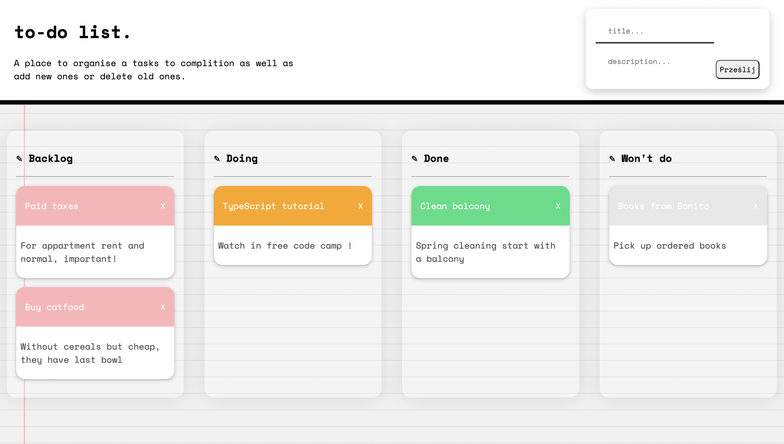
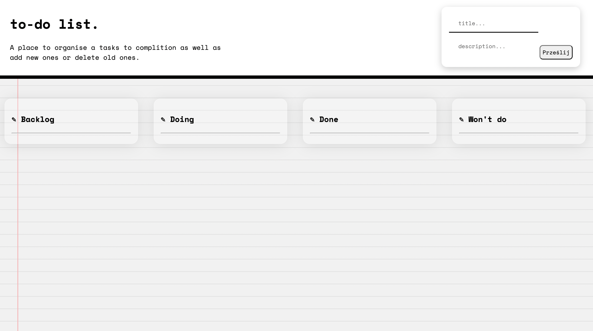

# js-css-html-kanban-board
"To-do list, but developed, help me practicing OOP (finally!), methods/properties of nodes and drag events. :)

# 🎫 TO-DO list (version 2.0) 🎫

## 🤓 What's it about?

To-do list, but developed, help me practicing OOP (finally!), methods/properties of nodes and drag events.

## 🤓 First look 
Blank space at teh beginig 

can be filled with task added in form at the right corner and dragged to a proper column.

## 🤓 Technologies

+ mostly JavaScript!

## 🤓 Inspiration
This little project is part of an amazing Full Stack Developer Course created by  ♥ Ania Kubow ♥. Love this women, her sense of humor and ability to explain hard, code-things in a way that I finally understand. 🏆
